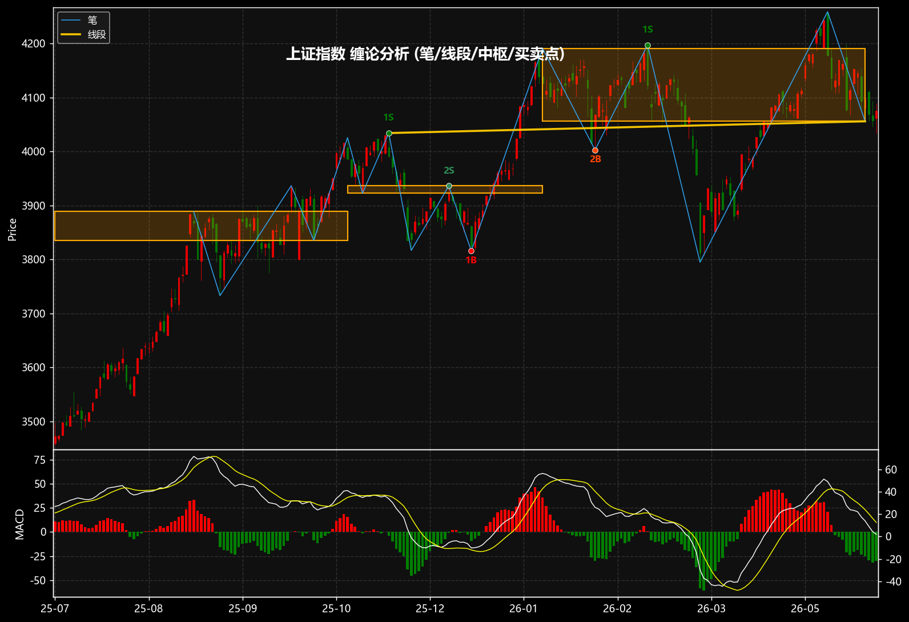

# chan-theory · 缠论技术分析框架的 Python 实现

把缠中说禅《教你炒股票》系列博客（[新浪博客](https://blog.sina.com.cn/s/articlelist_1215172700_0_1.html)，共108课）
中的“缠论”技术分析体系，**通读原文 → 提炼几何算法 → 用 Python 完整实现**，并在真实行情上可视化。

> 缠论本质是一套关于走势图形的几何理论。完整递归流水线：
> **原始K线 → 包含处理 → 分型 → 笔 → 线段 → 走势中枢 → 走势类型 → 背驰 → 三类买卖点**，并支持级别递归。



*（上证指数日线：蓝线=笔，黄线=线段，橙框=走势中枢，圆点=买卖点，下方=MACD红绿柱背驰）*

---

## 目录结构

```
chan-theory/
├── chanlun/                # 核心算法包
│   ├── models.py           # 数据结构: K线/分型/笔/线段/中枢/买卖点 + 枚举
│   ├── cmerge.py           # 包含处理(合并K线)          ← 课62/65
│   ├── fractal.py          # 分型识别                    ← 课62
│   ├── bi.py               # 笔的划分(走势腿跟踪)        ← 课62/65
│   ├── segment.py          # 线段划分(特征序列+缺口)     ← 课65/67
│   ├── zhongshu.py         # 走势中枢(公共重叠)          ← 课17/18
│   ├── macd.py             # MACD与背驰力度(红绿柱面积)  ← 课24
│   ├── signals.py          # 背驰 + 一/二/三类买卖点      ← 课17/24
│   ├── analyzer.py         # 主流程编排 + 多级别递归     ← 课17
│   └── plot.py             # mplfinance 标注绘图
├── corpus/                 # 抓取的博客原文(93课) + manifest.csv
├── scripts/
│   ├── scrape_blog.py      # 博客爬虫(curl绕过WAF, 断点续传)
│   └── fetch_data.py       # 拉取真实日线(Yahoo Finance)
├── examples/demo.py        # 端到端示例(生成标注图)
├── tests/test_chanlun.py   # 单元测试(几何不变量)
├── data/                   # 真实行情CSV + 生成的图
├── FRAMEWORK.md            # ★ 从原文提炼的框架与课程出处对照
├── README.md
└── requirements.txt
```

理论与代码的逐条对照见 **[FRAMEWORK.md](FRAMEWORK.md)**（每条规则均标注《教你炒股票》课程出处并附原文引用）。

## 安装

```bash
pip install -r requirements.txt   # numpy pandas matplotlib mplfinance (+可选 TA-Lib)
```

`MACD` 优先用 TA-Lib，未安装则自动回退到内置等价 EMA 实现（见 [`chanlun/macd.py`](chanlun/macd.py)）。

## 快速开始

```python
from chanlun.data import load_csv, make_sample
from chanlun.analyzer import ChanAnalyzer
from chanlun.plot import plot_analysis

raws = load_csv("data/AAPL.csv")        # 列: date,open,high,low,close[,volume]
# raws = make_sample()                  # 或用内置合成数据

ana = ChanAnalyzer(raws).run()
print(ana.summary())                    # 打印 笔/线段/中枢/买卖点 摘要

plot_analysis(ana, start=len(ana.raws)-240, save_path="chart.png")
```

`ChanAnalyzer(..., zhongshu_mode="extension")` 默认按公共重叠延伸中枢；
如需同级别分解视角，可设为 `zhongshu_mode="same_level"`，后续重叠段不会继续吞入同一中枢。

命令行：

```bash
python examples/demo.py                  # 合成数据
python examples/demo.py data/AAPL.csv    # 真实数据
```

分析结果可直接访问：`ana.merged / ana.fractals / ana.bis / ana.segments /
ana.bi_zhongshus / ana.seg_zhongshus / ana.bsps / ana.trend`。

## 真实数据与多级别

```bash
python scripts/fetch_data.py AAPL 000001.SS 600519.SS   # 拉取日线到 data/
```

多级别递归（同一份数据重采样到更高周期分别分析，课17）：

```python
import pandas as pd
from chanlun.analyzer import analyze_multi_level
df = pd.read_csv("data/000001.SS.csv")
res = analyze_multi_level(df, {"日线": None, "周线": "W", "月线": "ME"})
for name, a in res.items():
    print(name, a.trend, "买卖点", len(a.bsps))
```

## 买卖点（缠论的核心可操作结论）

| 类型 | 含义 | 依据 |
|------|------|------|
| **第一类** | 趋势背驰转折：下跌背驰→一买、上涨背驰→一卖 | 课17/24 |
| **第二类** | 一类点后首次回抽不破前低/前高 | 课17 买卖点定律一 |
| **第三类** | 离开中枢后回抽不重回中枢区间 [ZD,ZG] | 课18 中枢定理三 |

示例（AAPL 日线，节选）：

```
一买 @ 2022-06-16  价=129.04  下跌笔背驰(后笔绿柱面积更小) 力度比0.10
一卖 @ 2024-10-15  价=237.49  上涨笔背驰(后笔红柱面积更小) 力度比0.09
一买 @ 2025-04-08  价=169.21  下跌笔背驰(后笔绿柱面积更小) 力度比0.76
```

## 语料库

[`corpus/`](corpus/) 含从博客抓取的 93 篇《教你炒股票》正文（UTF-8 纯文本）与 [`manifest.csv`](corpus/manifest.csv) 索引。
**全部技术定义类课程（17/18/24/62–68/71/77/78 等）均已完整收录**；少数缺失（如7/9/30… 共约15篇）多为行情点评类短文，
不影响框架完整性。新浪反爬 WAF 会对 `python-requests` 返回 418，爬虫改用系统 `curl` 抓取并解析（见
[`scripts/scrape_blog.py`](scripts/scrape_blog.py)）。

## 测试

```bash
pytest tests/ -q     # 验证: 几何不变量/中枢模式/走势分类/买卖点/边界输入/端到端
```

## 工程取舍

缠论在笔/线段的边界情形（缺口确认、中枢延伸 vs 同级别新中枢）存在公认的实现分歧，缠本人也在课71/77/78 多次“再分辨”。
本实现的关键选择（线段特征序列的有界确认、中枢延伸/同级别分解模式、要求相关中枢的 MACD 背驰等）均在
[FRAMEWORK.md](FRAMEWORK.md) 与各模块 docstring 中标注出处，便于对照原文调整。

> ⚠️ 本项目用于**学习与研究缠论技术分析方法**，不构成任何投资建议。

## 参考

- 缠中说禅《教你炒股票》系列（新浪博客 UID 1215172700）——见 `corpus/`
- 关键课程：17（走势分类/中枢/买卖点）、18（中枢三定理）、24（MACD背驰）、62/65（分型笔线段）、67（线段划分标准）
